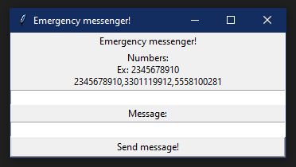

# Example Emergency Text
Simple, stupid application to send a text out to a set of numbers, nothing big.

## Probably requires...
- Python3
- Tkinter
- smtplib

## Setup and use
You don't have to do much, the most that has to be done to get this to work
is changing a few lines in the script.

### Authentication
To authenticate with a mail server, you have to change these 4 lines:
```py
emsrv = '' # smtp server (this is on line 5)
# exapmle: 'smtp.gmail.com'
eml = '' # email (this is on line 6)
# example: 'example-addr@gmail.com'
psw = '' # password (this is on line 7)
# example: 'blahblahpassword123'

# and you have to change the port here on line 12
srvr = smtplib.SMTP(emsrv, 587)
# for example, the port for the server I used was 587
```
Once you've changed these, the script is ready to run.

## GUI and number entry
The GUI was built to be as simple as possible, there's currently 2 text entries.<br>
One entry is for a list of phone numbers, separated by commas.<br>
For example, ``2025550161,2025550122`` etc.<br><br>
There's another entry area for the message you'd like to send, ideally you'd want to
keep it somewhat brief.<br><br>
The last part of the GUI is a send button, which runs the function to bounce to each
carrier address, the application may appear to have frozen up but I promise, it hasn't.
<br><br>
